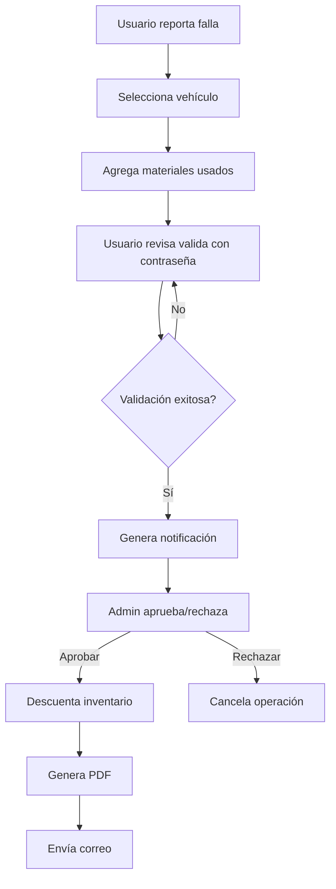

📘 README.md - Sistema FontTrack

FontTrack - Sistema de Gestión de Inventario y Mantenimiento Vehicular

<div align="center">
  
  
  [](https://laravel.com)
  [](https://php.net)
  [](https://mysql.com)
  [](https://getbootstrap.com)
  [](LICENSE)
</div>

---

##  Tabla de Contenidos

- [Descripción](#-descripción)
- [Características](#-características)
- [Arquitectura](#-arquitectura)
- [Tecnologías](#-tecnologías)
- [Requisitos](#-requisitos)
- [Instalación](#-instalación)
- [Configuración](#-configuración)
- [Uso](#-uso)
- [Estructura del Proyecto](#-estructura-del-proyecto)
- [Módulos](#-módulos)
- [API Endpoints](#-api-endpoints)
- [Testing](#-testing)
- [Contribución](#-contribución)
- [Créditos](#-créditos)
- [Licencia](#-licencia)

---

## 📖 Descripción

**FontTrack** es un sistema integral de gestión de inventario de materiales y mantenimiento vehicular desarrollado con Laravel. Permite el control eficiente de:

-  **Inventario de materiales** por ubicaciones
-  **Flota vehicular** y su mantenimiento
-  **Reportes de fallas** y uso de materiales
-  **Usuarios y permisos** por ubicación
-  **Gestión de lugares** (almacenes, talleres, sucursales)
-  **Sistema de notificaciones** en tiempo real
-  **Generación de reportes PDF** automáticos

El sistema está diseñado para empresas con múltiples ubicaciones que requieren control detallado de inventarios y mantenimiento de su flota vehicular.

---

##  Características

###  Funcionalidades Principales

####  Gestión de Materiales
- ✅ CRUD completo de materiales
- ✅ Control de existencias por ubicación
- ✅ Alertas de stock bajo
- ✅ Importación masiva desde Excel (Kardex)
- ✅ Exportación de inventarios
- ✅ Búsqueda y filtrado avanzado
- ✅ Historial de movimientos

####  Gestión de Vehículos
- ✅ Registro de flota vehicular
- ✅ Control de kilometraje
- ✅ Historial de mantenimiento
- ✅ Asociación con ubicaciones
- ✅ Información técnica detallada

####  Reportes de Fallas
- ✅ Registro de fallas y mantenimientos
- ✅ Asignación de materiales utilizados
- ✅ Generación automática de PDF
- ✅ Envío por correo electrónico
- ✅ Sistema de aprobación con validación
- ✅ Firmas digitales (usuario reporta/revisa)

####  Sistema de Notificaciones
- ✅ Notificaciones en tiempo real
- ✅ Aprobación/rechazo de reportes
- ✅ Validación con contraseña
- ✅ Actualización automática del inventario
- ✅ Contador visual de pendientes

####  Gestión de Usuarios
- ✅ Roles y permisos (Admin/Usuario)
- ✅ Asignación por ubicación
- ✅ Control de acceso granular
- ✅ Registro de auditoría

####  Gestión de Ubicaciones
- ✅ Múltiples almacenes/sucursales
- ✅ Estadísticas por ubicación
- ✅ Asignación de usuarios y materiales
- ✅ Reportes individualizados

---

##  Arquitectura

FontTrack implementa una arquitectura híbrida **MVC + MVVM + DAO** para máxima escalabilidad y mantenibilidad:
```
┌─────────────────────────────────────────────────────────────┐
│                    FLUJO DE ARQUITECTURA                    │
└─────────────────────────────────────────────────────────────┘

VIEW (Blade Templates)
    ↕️
CONTROLLER (Coordina peticiones HTTP)
    ↕️
VIEW MODEL (Prepara datos para vistas)
    ↕️
SERVICE (Lógica de negocio y validaciones)
    ↕️
REPOSITORY (Consultas complejas y agregaciones)
    ↕️
DAO (Operaciones CRUD básicas en BD)
    ↕️
MODEL (Eloquent ORM - Mapeo de tablas)
    ↕️
DATABASE (MySQL)
```

###  Patrones de Diseño Implementados

- **DAO (Data Access Object)**: Abstracción de acceso a datos
- **Repository Pattern**: Consultas complejas y lógica de datos
- **Service Layer**: Lógica de negocio centralizada
- **MVVM (Model-View-ViewModel)**: Preparación de datos para vistas
- **Dependency Injection**: Inyección de dependencias vía Service Container
- **Observer Pattern**: Eventos y listeners de Laravel

---

##  Tecnologías

### Backend
- **[Laravel 10.x](https://laravel.com)** - Framework PHP
- **[PHP 8.1+](https://php.net)** - Lenguaje de programación
- **[MySQL 8.0+](https://mysql.com)** - Base de datos
- **[Eloquent ORM](https://laravel.com/docs/eloquent)** - Mapeo objeto-relacional

### Frontend
- **[Bootstrap 5.3](https://getbootstrap.com)** - Framework CSS
- **[jQuery 3.6](https://jquery.com)** - Librería JavaScript
- **[Bootstrap Icons](https://icons.getbootstrap.com)** - Iconografía
- **[Font Awesome 6.0](https://fontawesome.com)** - Iconos adicionales
- **[Blade Templates](https://laravel.com/docs/blade)** - Motor de plantillas

### Librerías Adicionales
- **[Maatwebsite Excel](https://laravel-excel.com)** - Importación/exportación Excel
- **[DomPDF](https://github.com/barryvdh/laravel-dompdf)** - Generación de PDFs
- **[Laravel Sanctum](https://laravel.com/docs/sanctum)** - Autenticación API (opcional)

---

##  Requisitos

### Requisitos del Sistema
```bash
PHP >= 8.1
MySQL >= 8.0 o MariaDB >= 10.3
Composer >= 2.0
Node.js >= 16.x (para compilar assets)
Apache/Nginx con mod_rewrite habilitado
```

### Extensiones PHP Requeridas
```bash
- OpenSSL PHP Extension
- PDO PHP Extension
- Mbstring PHP Extension
- Tokenizer PHP Extension
- XML PHP Extension
- Ctype PHP Extension
- JSON PHP Extension
- BCMath PHP Extension
- Fileinfo PHP Extension
- GD PHP Extension (para manipulación de imágenes)
```

---

## 🚀 Instalación

### Método 1: Instalación Manual
```bash
# 1. Clonar el repositorio
git clone https://github.com/tu-usuario/fonttrack.git
cd fonttrack

# 2. Instalar dependencias de PHP
composer install

# 3. Copiar archivo de configuración
cp .env.example .env

# 4. Generar key de la aplicación
php artisan key:generate

# 5. Configurar base de datos en .env
# Editar DB_DATABASE, DB_USERNAME, DB_PASSWORD

# 6. Ejecutar migraciones
php artisan migrate

# 7. Ejecutar seeders (datos de ejemplo)
php artisan db:seed

# 8. Crear link simbólico para storage
php artisan storage:link

# 9. Instalar dependencias de Node (opcional)
npm install
npm run build

# 10. Iniciar servidor de desarrollo
php artisan serve
```

### Método 2: Usando Docker (Recomendado)
```bash
# 1. Clonar repositorio
git clone https://github.com/tu-usuario/fonttrack.git
cd fonttrack

# 2. Levantar contenedores
docker-compose up -d

# 3. Instalar dependencias
docker-compose exec app composer install

# 4. Configurar aplicación
docker-compose exec app cp .env.example .env
docker-compose exec app php artisan key:generate

# 5. Ejecutar migraciones
docker-compose exec app php artisan migrate --seed

# 6. Crear link de storage
docker-compose exec app php artisan storage:link
```

Acceder a: `http://localhost:8000`

---

## ⚙️ Configuración

### 1. Configurar Base de Datos

Editar `.env`:
```env
DB_CONNECTION=mysql
DB_HOST=127.0.0.1
DB_PORT=3306
DB_DATABASE=inventariofinal
DB_USERNAME=root
DB_PASSWORD=tu_password
```

### 2. Configurar Correo Electrónico (Para reportes)
```env
MAIL_MAILER=smtp
MAIL_HOST=smtp.gmail.com
MAIL_PORT=587
MAIL_USERNAME=tu_email@gmail.com
MAIL_PASSWORD=tu_app_password
MAIL_ENCRYPTION=tls
MAIL_FROM_ADDRESS=tu_email@gmail.com
MAIL_FROM_NAME="${APP_NAME}"
```

### 3. Configurar Storage
```bash
# Crear directorios necesarios
php artisan storage:link

# Permisos (Linux/Mac)
chmod -R 775 storage bootstrap/cache
chown -R www-data:www-data storage bootstrap/cache
```

### 4. Usuario Administrador por Defecto

Después de ejecutar seeders:
```
Email: admin@fonttrack.com
Contraseña: password
```

** CAMBIAR CONTRASEÑA INMEDIATAMENTE EN PRODUCCIÓN**

---

##  Uso

### Inicio Rápido

1. **Acceder al sistema**
```
   http://localhost:8000
```

2. **Iniciar sesión**
   - Usar credenciales de administrador

3. **Configurar lugares**
   - Ir a "Lugares" → Crear almacenes/sucursales

4. **Registrar usuarios**
   - Ir a "Inicio" → Asignar usuarios a lugares

5. **Importar inventario**
   - Ir a "Materiales" → "Subir Kardex"
   - Seleccionar archivo Excel con formato requerido

6. **Registrar vehículos**
   - Ir a "Vehículos" → Agregar vehículos de la flota

7. **Crear reportes de fallas**
   - Click en "Reporte de Fallas"
   - Seleccionar vehículo y materiales utilizados
   - Generar PDF

### Flujo de Trabajo Típico


---

## 📁 Estructura del Proyecto
```
fonttrack/
├── app/
│   ├── Console/                # Comandos Artisan personalizados
│   ├── DAO/                    # Data Access Objects
│   │   ├── Interfaces/         # Contratos DAO
│   │   └── Implementations/    # Implementaciones concretas
│   ├── Exceptions/             # Manejo de excepciones
│   ├── Http/
│   │   ├── Controllers/        # Controladores
│   │   ├── Middleware/         # Middleware personalizado
│   │   └── Requests/           # Form Requests (validaciones)
│   ├── Models/                 # Modelos Eloquent
│   ├── Providers/              # Service Providers
│   ├── Repositories/           # Repositorios
│   ├── Services/               # Servicios (lógica de negocio)
│   └── ViewModels/             # View Models
├── bootstrap/                  # Archivos de arranque
├── config/                     # Configuraciones
├── database/
│   ├── factories/              # Factories para testing
│   ├── migrations/             # Migraciones de BD
│   └── seeders/                # Seeders
├── public/
│   ├── css/                    # Estilos compilados
│   ├── img/                    # Imágenes
│   └── js/                     # Scripts compilados
├── resources/
│   ├── views/                  # Vistas Blade
│   │   ├── materials/          # Vistas de materiales
│   │   ├── usuarios/           # Vistas de usuarios
│   │   ├── lugares/            # Vistas de lugares
│   │   ├── vehiculos/          # Vistas de vehículos
│   │   └── reportes/           # Vistas de reportes
│   ├── css/                    # CSS fuente
│   └── js/                     # JavaScript fuente
├── routes/
│   ├── web.php                 # Rutas web
│   ├── api.php                 # Rutas API
│   └── console.php             # Comandos de consola
├── storage/
│   ├── app/                    # Archivos de aplicación
│   ├── framework/              # Archivos del framework
│   └── logs/                   # Logs del sistema
├── tests/                      # Tests automatizados
├── .env.example                # Plantilla de configuración
├── artisan                     # CLI de Laravel
├── composer.json               # Dependencias PHP
├── package.json                # Dependencias Node
└── README.md                   # Este archivo
```

---

##  Módulos

### 1. Materiales (`/materials`)

**Funcionalidades:**
- ✅ Listado con paginación y búsqueda
- ✅ CRUD completo
- ✅ Control de existencias
- ✅ Importación desde Excel
- ✅ Exportación a Excel
- ✅ Filtrado por ubicación

**Archivos principales:**
```
app/DAO/Implementations/MaterialDAO.php
app/Repositories/MaterialRepository.php
app/Services/MaterialService.php
app/ViewModels/MaterialViewModel.php
app/Http/Controllers/MaterialController.php
resources/views/materials/index.blade.php
```

### 2. Usuarios (`/users`)

**Funcionalidades:**
- ✅ Gestión de usuarios
- ✅ Roles (Admin/Usuario)
- ✅ Asignación a lugares
- ✅ Subida de fotos de perfil
- ✅ Validación de contraseñas

**Archivos principales:**
```
app/DAO/Implementations/UsuarioDAO.php
app/Repositories/UsuarioRepository.php
app/Services/UsuarioService.php
app/ViewModels/UsuarioViewModel.php
app/Http/Controllers/UsuarioController.php
```

### 3. Lugares (`/lugares`)

**Funcionalidades:**
- ✅ Gestión de ubicaciones
- ✅ Estadísticas por lugar
- ✅ Asignación de usuarios
- ✅ Control de materiales

### 4. Vehículos (`/vehiculos`)

**Funcionalidades:**
- ✅ Registro de flota
- ✅ Historial de mantenimiento
- ✅ Control de kilometraje
- ✅ Asociación con lugares

### 5. Reportes de Fallas (`/reportes`)

**Funcionalidades:**
- ✅ Creación de reportes
- ✅ Asignación de materiales
- ✅ Generación de PDF
- ✅ Sistema de notificaciones
- ✅ Validación con contraseña
- ✅ Envío por correo

---

##  API Endpoints

### Materiales
```http
GET    /materials              # Listar materiales
POST   /materials              # Crear material
GET    /materials/{id}         # Ver material
PUT    /materials/{id}         # Actualizar material
DELETE /materials/{id}         # Eliminar material
POST   /materials/{id}/aumentar # Aumentar existencia
POST   /materials/import       # Importar desde Excel
GET    /materials/export       # Exportar a Excel
```

### Usuarios
```http
GET    /users                  # Listar usuarios
POST   /users                  # Crear usuario
GET    /users/{id}             # Ver usuario
PUT    /users/{id}             # Actualizar usuario
DELETE /users/{id}             # Eliminar usuario
```

### Lugares
```http
GET    /lugares                # Listar lugares
POST   /lugares                # Crear lugar
GET    /lugares/{id}           # Ver lugar
PUT    /lugares/{id}           # Actualizar lugar
DELETE /lugares/{id}           # Eliminar lugar
GET    /lugares/{id}/usuarios  # Usuarios del lugar
```

### Notificaciones
```http
GET    /notificaciones/contador           # Contador de pendientes
GET    /notificaciones/pendientes         # Listar pendientes
GET    /notificaciones/{id}               # Ver detalles
POST   /notificaciones/{id}/aprobar       # Aprobar notificación
POST   /notificaciones/{id}/rechazar      # Rechazar notificación
```

---

##  Testing

### Ejecutar Tests
```bash
# Todos los tests
php artisan test

# Tests específicos
php artisan test --filter MaterialTest

# Con cobertura
php artisan test --coverage
```

### Crear Tests
```bash
# Test de Feature
php artisan make:test MaterialTest

# Test Unitario
php artisan make:test MaterialServiceTest --unit
```

---

##  Contribución

### Cómo Contribuir

1. **Fork el repositorio**
2. **Crear rama de feature**
```bash
   git checkout -b feature/nueva-funcionalidad
```
3. **Commit de cambios**
```bash
   git commit -m 'Add: nueva funcionalidad increíble'
```
4. **Push a la rama**
```bash
   git push origin feature/nueva-funcionalidad
```
5. **Abrir Pull Request**

### Guía de Estilo

- Seguir PSR-12 para código PHP
- Documentar funciones con PHPDoc
- Escribir tests para nuevas funcionalidades
- Commits descriptivos en español

### Reportar Bugs

Usa el [Issue Tracker](https://github.com/tu-usuario/fonttrack/issues) con:
- Descripción clara del problema
- Pasos para reproducir
- Comportamiento esperado vs actual
- Screenshots si aplica
- Versión de PHP, Laravel, navegador

---

##  Créditos

### Desarrollador Principal
- **Jesus Felipe Aviles** - *Desarrollo Full Stack*

### Tecnologías y Agradecimientos
- [Laravel Framework](https://laravel.com)
- [Bootstrap Team](https://getbootstrap.com)
- Comunidad Open Source

---

##  Licencia

Este proyecto está bajo la Licencia MIT - ver el archivo [LICENSE](LICENSE) para más detalles.
```
MIT License

Copyright (c) 2024 FontTrack

Permission is hereby granted, free of charge, to any person obtaining a copy
of this software and associated documentation files (the "Software"), to deal
in the Software without restriction, including without limitation the rights
to use, copy, modify, merge, publish, distribute, sublicense, and/or sell
copies of the Software, and to permit persons to whom the Software is
furnished to do so, subject to the following conditions:

The above copyright notice and this permission notice shall be included in all
copies or substantial portions of the Software.
```

---

##  Contacto

- **Autor**: Jesus Felipe Aviles
- **Email**: al222310418@gmail.com
- **GitHub**: [@tu-usuario](https://github.com/JesusFelipeA)

---

##  Estadísticas del Proyecto


---

##  Roadmap

###  Versión 1.0 (Actual)
- [x] CRUD de materiales
- [x] CRUD de usuarios
- [x] CRUD de lugares
- [x] CRUD de vehículos
- [x] Sistema de reportes de fallas
- [x] Sistema de notificaciones
- [x] Generación de PDFs
- [x] Importación/exportación Excel

###  Versión 1.1 (En Desarrollo)
- [ ] Dashboard con gráficas
- [ ] Reportes analíticos avanzados
- [ ] API RESTful completa
- [ ] App móvil (Flutter)
- [ ] Sistema de backup automático

###  Versión 2.0 (Futuro)
- [ ] Predicción de mantenimiento (IA)
- [ ] Integración con IoT
- [ ] Sistema de facturación
- [ ] Multi-idioma
- [ ] Modo offline

---

##  Documentación Adicional

- [ Guía de Instalación Detallada](docs/INSTALLATION.md)
- [ Arquitectura del Sistema](docs/ARCHITECTURE.md)
- [ Documentación API](docs/API.md)
- [ Guía de Contribución](CONTRIBUTING.md)
- [ Changelog](CHANGELOG.md)

---

##  FAQ

<details>
<summary><b>¿Cómo reseteo la contraseña de un usuario?</b></summary>
```bash
php artisan tinker

$user = App\Models\User::find(1);
$user->password = Hash::make('nueva_contraseña');
$user->save();
```
</details>

<details>
<summary><b>¿Cómo agrego un nuevo lugar?</b></summary>

Navega a "Lugares" → "Crear Lugar" o usa tinker:
```bash
php artisan tinker

App\Models\Lugar::create([
    'nombre' => 'Nuevo Almacén',
    'direccion' => 'Dirección completa',
    'telefono' => '1234567890'
]);
```
</details>

<details>
<summary><b>¿Cómo exporto todo el inventario?</b></summary>

Navega a "Materiales" → Click en "Exportar Excel"
</details>

---

<div align="center">

** Si este proyecto te fue útil, considera darle una estrella ⭐**

Hecho con el corazón por el equipo de FontTrack

[ Inicio](#-fonttrack---sistema-de-gestión-de-inventario-y-mantenimiento-vehicular) • [ Docs](docs/) • [ Reportar Bug](issues/) • [ Solicitar Feature](issues/)

</div>

 Extras: Badges y Shields Adicionales
Si quieres personalizar más tu README, aquí hay badges adicionales:
markdown<!-- Status -->


<!-- Métricas -->


<!-- Social -->


